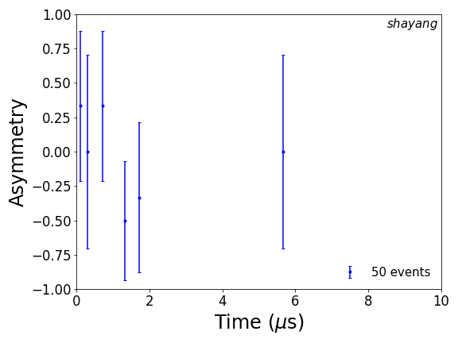

# muSR Simulation Visualization 
⚛️ A statistics-based simulation of a simple muon spin rotation/relaxation experiment.

Written by Shayan Gheidi.
## About

This script (crudely) simulates and approximates some basic concepts of a muon spin rotation experiment in two-dimensions. 

## How it works

Each incoming muon is considered independently. Accordingly, the time-to-decay of each muon, the relative angle of the muon spin, the energy of the emitted positron and finally the direction of the emitted positron are all sampled from their probability distribution function (or approximations to their PDFs) to determine if the event is a "forward" or "backward" event. The events are then binned and plotted. A magnetic field or distribution of magnetic fields perpendicular to the muon spin polarization can be input into the script.

Ideally, this code can be developed further to place muons in realistic magnetic environments as well.

## Usage

Install requirements:

    pip install -r requirements.txt
    
Run the code:

    musr(nevents,magfield) 

where nevents is the number of events you wish to evaluate and magfield is the magnetic field (in Tesla). If the entered field value is too large you will have to increase the number of bins, of course (k parameter in the source). 

