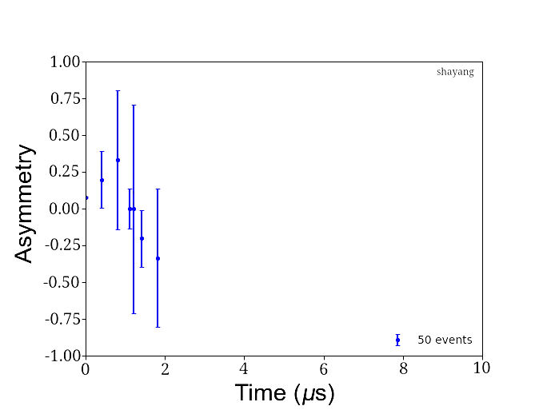

# musr_visual_sim
⚛️ A statistics-based simulation of simple musr experiments (incomplete)

# About

This script (crudely) simulates and approximates some basic concepts of a muon spin rotation experiment in two-dimensions. 

# How it works

Each incoming muon is considered independently. Accordingly, the time-to-decay of each muon, the relative angle of the muon spin, the energy of the emitted positron and finally the direction of the emitted positron are all sampled from approximations of their distributions to determine if the event is a "forward" or "backward" event. The events are then binned and plotted. A magnetic field or distribution of magnetic fields perpendicular to the muon spin polarization can be input into the script.

Ideally, this code can be developed further to place muons in realistic magnetic environments as well.

